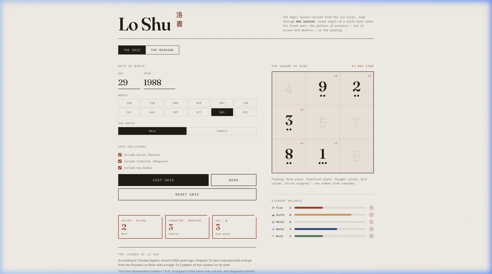

# Lo Shu Grid · 洛書

> An interactive, premium client-side Web application to cast, analyze, and understand the ancient Lo Shu Magic Square through modern design and detailed metaphysical interpretation.

<p align="center">
  
</p>

---

## 📖 Table of Contents
- [Background & Legend](#-background--legend)
- [Core Features](#-core-features)
- [How to Use](#%EF%B8%8F-how-to-use)
- [Grid Layout & Coordinate System](#-grid-layout--coordinate-system)
- [Local Development & Printing](#-local-development--printing)
- [License & Reference](#-license--reference)

---

## 🐢 Background & Legend

According to ancient Chinese history, around 4,000 years ago, Emperor Yu saw a sacred turtle emerge from the flooded Luo River. The turtle's shell bore a magic $3 \times 3$ grid of dot clusters representing the numbers **1 through 9**. 

This magic square—known as the **Lo Shu Grid**—has the unique mathematical property where **every row, column, and diagonal adds up to exactly 15**. In Chinese metaphysics:
* **15** is the number of days in each of the 24 cycles of the solar year.
* The square represents the cosmic order, balancing the five elements (Water, Wood, Fire, Earth, Metal) and guiding the flow of Qi.

Through **Ank Jyotish** (Vedic Numerology), your birth date is mapped directly to these coordinates to reveal strengths, weaknesses, elements in excess, and developmental growth paths.

---

## ✨ Core Features

* **Interactive Magic Square**: Watch the grid dynamically assemble, count occurrences, and paint connecting lines (Planes/Yogs) using ink-brush SVG animations.
* **Fidelity Interpretation Tooltips**: Hover over any grid cell to view its elemental, planetary, and directional associations alongside a detailed "Why" explanation card.
* **Metaphysical Explanations**: Every reading entry has a `?` badge explaining the underlying calculation rules (e.g., Driver, Conductor, Kua, Maitri) or Feng Shui meaning.
* **Element Balance Visualizer**: Dynamically scales and colors progress bars tracking the balance of Fire, Earth, Metal, Water, and Wood coordinates.
* **Dynamic Highlight Hooks**: Hovering over plane or number readings on the left temporarily highlights their exact coordinates and connections on the grid.
* **Grid Customization**: Toggle whether to pool calculated numbers (Driver, Conductor, Kua) into your grid counts or evaluate raw date digits only.
* **Plaintext Export**: A "Copy Text" action formats your entire reading into a clean report to save or share.
* **Print-Ready Styles**: Standard browser print layouts (`Cmd + P` / `Ctrl + P`) auto-format the report on a clean white canvas, hiding form inputs and buttons for clean PDFs.

---

## 🕹️ How to Use

Since the application is fully client-side and self-contained, no complex server environment is required:

1. **Clone the repository**:
   ```bash
   git clone https://github.com/siddharthachaturvedi/loshu.git
   cd loshu
   ```
2. **Open the application**:
   * On macOS: `open loshu.html`
   * On Windows: Double-click `loshu.html` or open it directly in Google Chrome, Safari, Firefox, or Edge.
3. **Run a demo**: Click the **Demo** button to pre-fill the form with a demo date (`29 November 1988`) and see the grid and readings render instantly.

---

## 🎛️ Grid Layout & Coordinate System

The Lo Shu Grid arranges the coordinates in a fixed layout. Each seat corresponds to an element, direction, and life department:

| 4 (Wood · SE)<br>Wealth & Discipline | 9 (Fire · S)<br>Fame & Ambition | 2 (Earth · SW)<br>Relationships & Intuition |
| :---: | :---: | :---: |
| **3 (Wood · E)**<br>Family & Growth | **5 (Earth · Center)**<br>Self & Core Anchor | **7 (Metal · W)**<br>Wisdom & Creativity |
| **8 (Earth · NE)**<br>Knowledge & Patience | **1 (Water · N)**<br>Career & Expression | **6 (Metal · NW)**<br>Mentors & Travel |

### The 8 Lines of Force (Yogs/Planes)
The lines represent circuits where energy flows:
1. **Mind Plane (4-9-2)**: Intellectual power, memory, and perception.
2. **Emotion Plane (3-5-7)**: Compassion, empathy, and intuitive health.
3. **Practical Plane (8-1-6)**: Execution skills and material grounding.
4. **Thought Column (4-3-8)**: Structured planning and resolve.
5. **Will Column (9-5-1)**: Willpower, motivation, and persistent drive.
6. **Action Column (2-7-6)**: Action, execution speed, and quick reflexes.
7. **Golden Diagonal (4-5-6)**: Material opportunity, luck, and compounding recognition.
8. **Silver Diagonal (2-5-8)**: Grounded focus, determination, and property wealth.

---

## 🖨️ Local Development & Printing

* **Tailoring Styles**: Custom CSS variables are defined in the `:root` pseudo-class (e.g., `--paper`, `--cinnabar`, `--ink`) to customize colors and aesthetics.
* **Saving PDFs**: Press `Cmd + P` or `Ctrl + P` to trigger the print dialog. Hide headers/footers in your print settings to export a pristine PDF report.

---

## 📜 License & Reference

* ** Lineage**: Planets mapping, Maitri (friendship), and Yog names vary slightly by numerology schools (e.g., Chaudhry school vs. others). Key constants are marked clearly in the code source for custom overrides.
* Released under the MIT License. Feel free to copy, study, and adapt the magic square engine!
